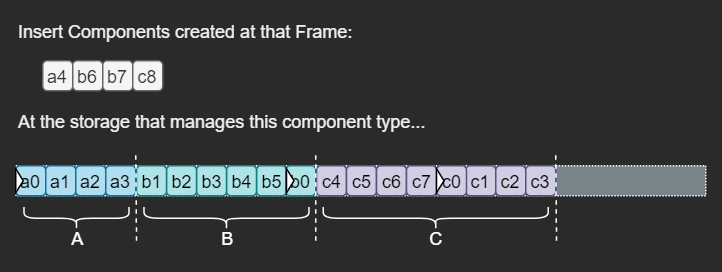

# Ravine ECS
This repository is the **Entity Component System** architecture implementation to be integrated with the [Ravine](https://github.com/gabriellanzer/Ravine) framework. It is written using C++14 features and has a special storage focused on linear cache access to ensure extreme performance. That is achieved through the concept of cyclic arrays, and done through a couple of control operations. The performance was validated through a benchmark against Skypjack's [EnTT](https://github.com/skypjack/entt) library, and it's repo can be found [here](https://github.com/gabriellanzer/Ravine-ECS-Benchmark) (TL;DR: got almost twice the iteration performance - but EnTT has many more features), I also did an [integration with OpenGL and a comparison of the DOD ECS vs Bad OOD](https://github.com/gabriellanzer/Ravine-ECS-Showdown) - sorry linux users, Visual Studio solutions only...

## How to use

TODO - Document the general API usage. Code is mostly self-explanatory though...

## Storage Scheme 
To ensure the lowest cache-miss frequencies as possible, while mantaining a few nice features of linear access, I decided to have storage **arrays per component types**. Each of these arrays is holds groups of components, **ordered by their entities archtypes**. A given storage state is represented by the following diagram:

## Cyclic Arrays
There are a few interesting points. In this representation, each component has the internal entity id (position inside the group) written on it. It is possible to see that some groups have an offset with respect to their actual initial positions (id 0 is shifted). That is due to the **cyclic behaviour** of each group. Most notably, the **Blue Group** represents the entity archtype of types A and B, and it has different offsets on each of it's storage arrays (0 on Storage\<A> and 2 on Storage\<B>).

The concept of cyclic arrays is to avoid re-allocating the whole array each time a insertion needs to happen, and to avoid any kind of look-up table, which would trash the cache lines. In this concept, there are a few operations needed to maintain the arrays in order (respecting the offset). There is, also, a special way of iterating through those arrays - we want to squeeze every inch of the CPU.

Here is a representation of the cyclic array being pushed aside (clock-wise roll operation), which demonstrates how the cyclic behaviour works.

With offset at 0 (aligned):

Being push aside (clock-wise):

The final state, offset at 3:

Instead of accessing this array at the first element, the iteration happens from the position 3 (zero-based) to position 5, and wraps around from 0 to 2. The idea is expanded through groups that are shared across many component storages (when they represent complex archtypes). The idea is to ensure each of the pointers match the correct components of a given entity, regardless of the group offset. The following chapter will explain the basic storage operations and how the actual iteration works.

## Storage Operations
For performance reasons, both the creation and removal of entities might be deferred to the end of the frame. From the storage perspective, it receives a list of components to work with, thus enabling the batching of operations. These operations could happen atomically, but require special handling of current iteration pointers (on the TODO list for now).

Keep in mind that the actual entity creation and destruction operations need to manage multiple storages at the same time, and every storage operation

### **Insertion**
The following diagrams represent the insertion of components of a given type on the proper storage, **A, B and C** are groups of different archtypes whose components **a4, b6, b7 and c8** belong to. Keep in mind that the components are sorted the same way that the groups are.

Check if the storage has enough size:

Figure what component goes where:

From **right to left**, start to open spaces for complex archtype groups. Roll group C three positions (for **a4, b6, b7**):

To insert **c8** at the end of the array (before **c0**), shift **c7** left (which wraps to the end of the group):

Now we can insert **c8** and make space for **a4** by rolling the B group in a clock-wise manner:

To insert **b6 and b7** shift components to the left and wrap around:

All space is open, now to insert **a4, b6 and b7**:

The final storage state:

### **Removal**

The removal operation is design to work with a list of Components marked to be destroyed at the current frame. In the following diagrams, the components **a3, b4, b7, c4, c5 and c8** will be removed from the storage groups **A, B and C**. Like the creation operation, the components are sorted the same way of the groups they belong to.

First, we compute the compression operation:.

Each compression happens on a per-group basis, from left to right:

When a new group is compressed it opens space in between:

That must be closed by rolling the group in a counter-clockwise manner:

Inside each group, the compression happens from the left to the right as well:

The ammount of spaces to be filled are accumulated through the compression operations, so they need to to be calculated separatelly.

And the final storage state:

### **Iteration**

TODO
